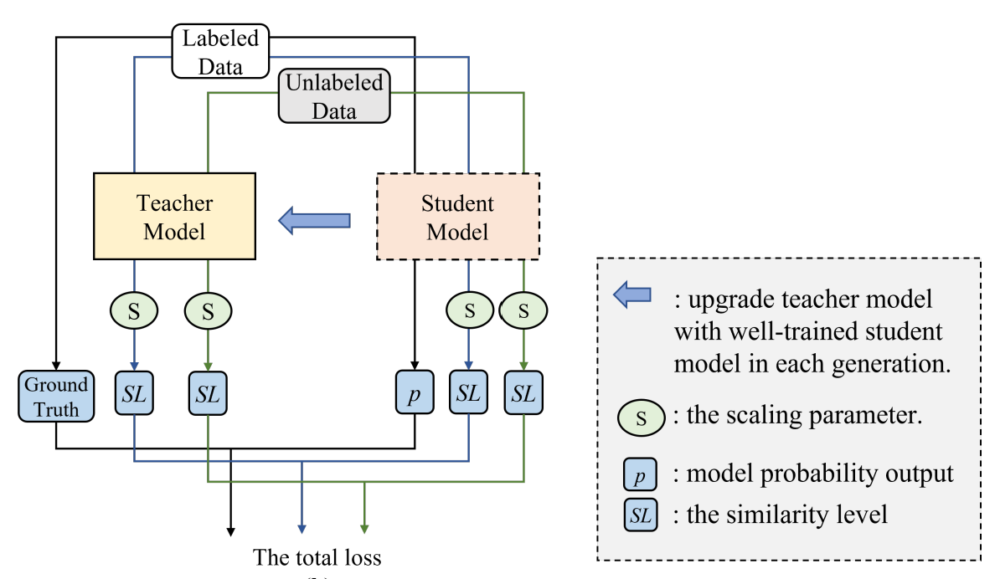
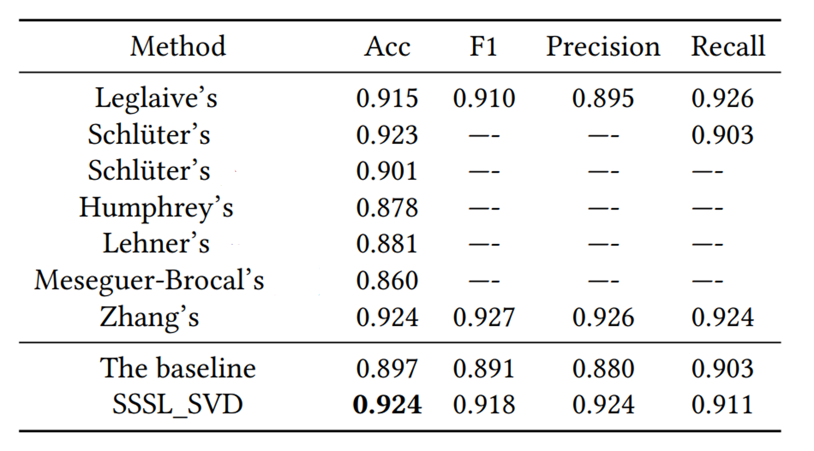

# Singing Voice Detection via Similarity-based Semi-supervised Learning (SSSL_SVD)    

This is a PyTorch implementation of the Singing Voice Detection via Similarity-based Semi-supervised Learning in ACM MM Asia 2022.       
<div align=center></div>  
    
The 'SchCNN_0.918_0.924.pkl' is the model trained with SSSL_SVD, whose performance is on par with SOTA, with an acc of <strong>0.924</strong> and F1 of <strong>0.918</strong>.    
<div align=center></div>

## Installation    
```bash     
git clone https://github.com/OzymandiasChen/SSSL_SVD.git
cd SSSL_SVD
sudo pip install -r requirements.txt
```

## Data    
### Labeled Data    
1. Download Jamendo Corpus.    
2. Organise the dataset directory as follows:    
	```bash
	jamendo/
	|-- audio/
	|-- filelists/
	|	|-- train
	|	|-- test
	|	|-- valid
	|	|-- recreate.sh
	|-- labels/
	```
3. Fill Jamendo Corpus folder path in the 10th line of 'config.py'.    
4. For log-melsepctrogram extraction, run        
	```bash
	cd dataloader
	python JamendoProcessor.py --option rawDataProcessing
	cd ..
	```      
### Unlabeled Data      
1. Download unlabeled data into M folders with each folder contains unlabeled music pieces for the ith generation of SSSL_SVD training.     
2. Organise the dataset directory as follows:  
	```bash
	unlabeled/
	|-- U_2/
	|-- U_3/
	...
	|-- U_M/
	```
3. Fill unlabeled dataset folder path in the 11th line of 'config.py'.    
4. For log-melsepctrogram extraction, run        
	```bash
	cd dataloader
	python UnlabelProcessor.py --audio2mel True
	cd ..
	```    

## Train  
### Generation 1: Train a model using supervised learning.    
1. Fill 'NaiveNN' in the 84th line of 'config.py'.    
2. Run:
	```bash
	python train.py --expName g1
	```
3. Copy 'logs/g1/bestModel_acc.pkl' to 'SSSL_SVD/teschers' and rename it as 't2' 
4. Add an item to config.py like
	```python
	TEACHER_INFO['t1'] = {'model': 'SchZM', 
				'name': 't1.pkl',
				'description': 'generation: 1'
			}
	```
### Generation i: Use the teacher model to train a student model. (i>=2) 
1. Fill 'SSSL' in the 84th line of 'config.py'.   
2. Change "UNLABEL_FOLDER_LIST = ['']" to "UNLABEL_FOLDER_LIST = ['U_{i}']" in the 115th line of 'config.py'.  
3. Change "TEACHER_LIST = ['']" to "TEACHER_LIST = ['t{i}']" in the 115th line of 'config.py'.   
4. Run:
	```bash
	python train.py --expName g{i}
	```
5. Copy 'logs/g{i}/bestModel_acc.pkl' to 'SSSL_SVD/teschers' and rename it as 't{i+1}' 
6. Add an item to config.py like
	```python
	TEACHER_INFO['t{i}'] = {'model': 'SchZM', 
				'name': 't{i}.pkl',
				'description': 'generation: {i}'
			}
	```
7. Check 'SSSL_SVD/logs/g{i}/trainLog.txt', enter 'Generation {i+1} 'if there is an improvement on the validation set.   

## Test   
	python eval.py --expName g{the total generation num}    


